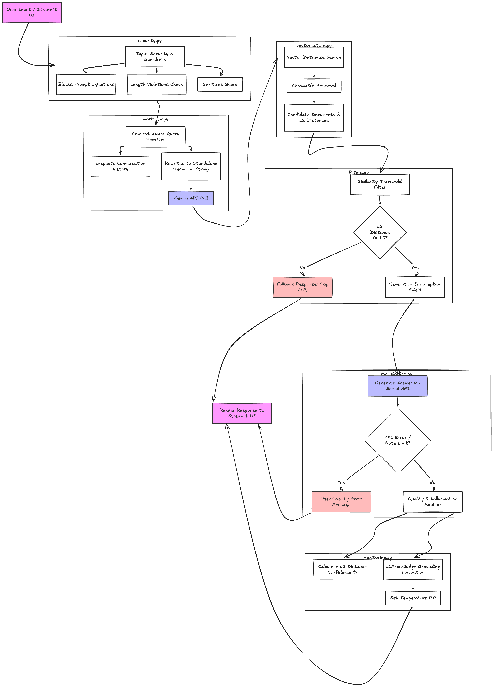

# 🏛️ System Architecture — RAG Learning Application

This document provides a high-level architectural overview of the Retrieval-Augmented Generation (RAG) Learning Application.

---

## 🔄 Component Breakdown & Data Flow

### 1. Client & Presentation Layer (`app.py`)
- **Streamlit UI:** Manages session state, conversation history logging, source accordions, confidence badges, and grounding metrics.

### 2. Boundary Guardrails & Input Validation (`security.py`)
- **Length Boundaries:** Enforces character constraints (`MAX_QUERY_LENGTH = 500`).
- **Pattern Matching:** Intercepts system directive overrides, prompt injections, and identity hijacking attempts using string and regex pattern checks prior to database access.

### 3. Multi-Step Workflow Processing (`workflow.py`)
- **Context-Aware Query Rewriting:** Leverages recent conversation history to resolve pronouns ("it", "that") and converts casual input into an optimized, standalone technical search prompt using Gemini (`temperature=0.1`).
- **Query Decomposition:** Splits complex multi-part questions into individual sub-questions for targeted multi-hop retrieval.

### 4. Vector Storage & Semantic Search (`vector_store.py` / `embeddings.py`)
- **Embedding Generation:** Converts user queries into vector embeddings.
- **ChromaDB Store:** Queries local vector collections to retrieve $K$-nearest neighbor document matches and associated L2 distance scores.

### 5. Context Filtering & Graceful Fallbacks (`filters.py`)
- **Similarity Threshold Filter:** Filters out documents exceeding the distance threshold (`L2 distance <= 1.0`).
- **Early-Exit Fallback:** If zero documents pass filtering, the system skips LLM execution and immediately returns a helpful fallback response explaining supported topic domains.

### 6. Core Answer Generation & Error Shielding (`rag_pipeline.py`)
- **Gemini LLM Call:** Constructs the final RAG prompt incorporating filtered context and delegates generation to Gemini.
- **Exception Handling:** Intercepts API rate limits, authentication failures, or connection crashes and converts them into user-friendly notifications.

### 7. Evaluation & Hallucination Monitoring (`monitoring.py`)
- **Confidence Scoring:** Converts L2 vector distances into a normalized `0%–100%` confidence metric.
- **LLM-as-Judge Grounding Check:** Runs a secondary deterministic LLM evaluation (`temperature=0.0`) to classify model output alignment as `GROUNDED`, `PARTIAL`, or `HALLUCINATED`.